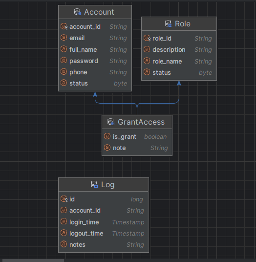
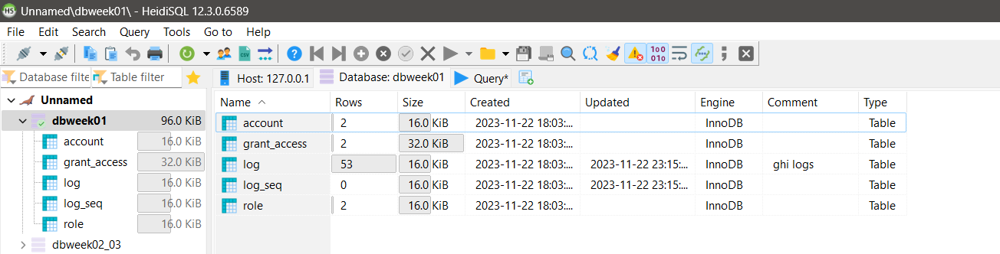
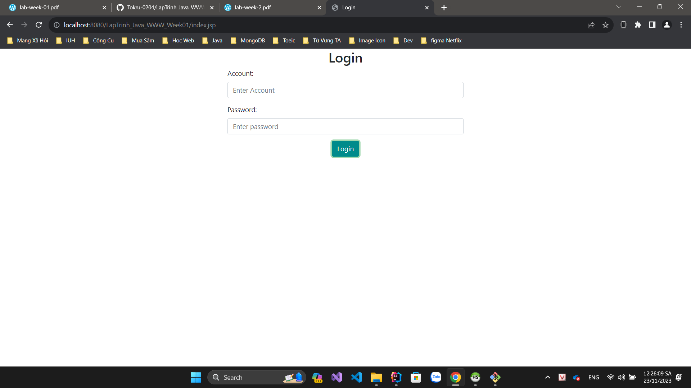
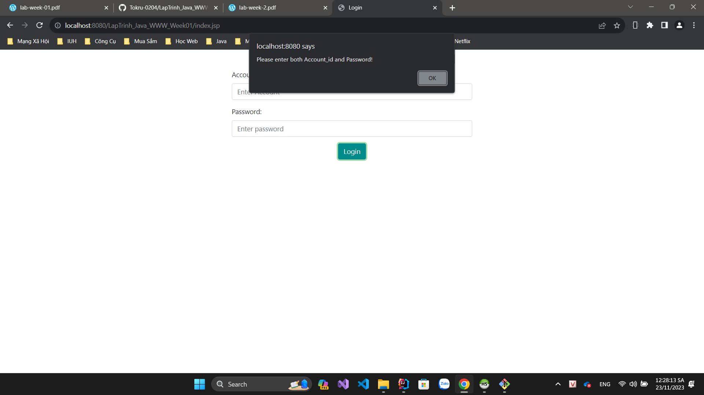
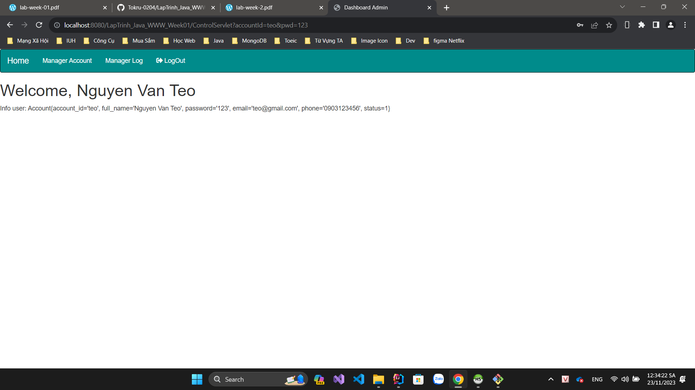
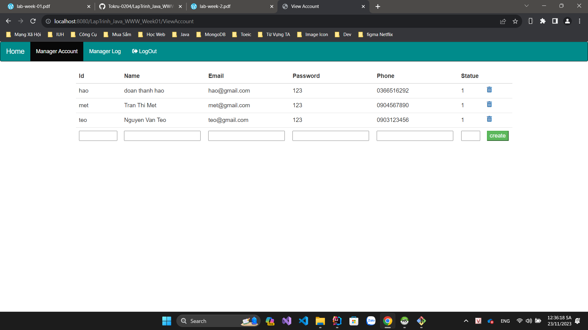
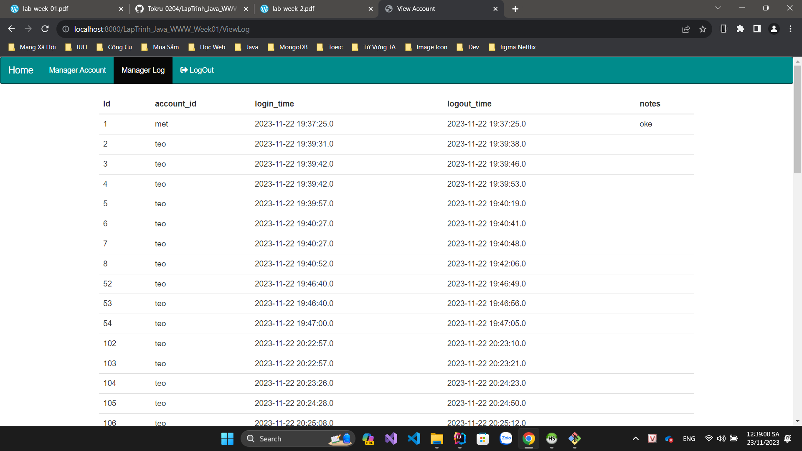
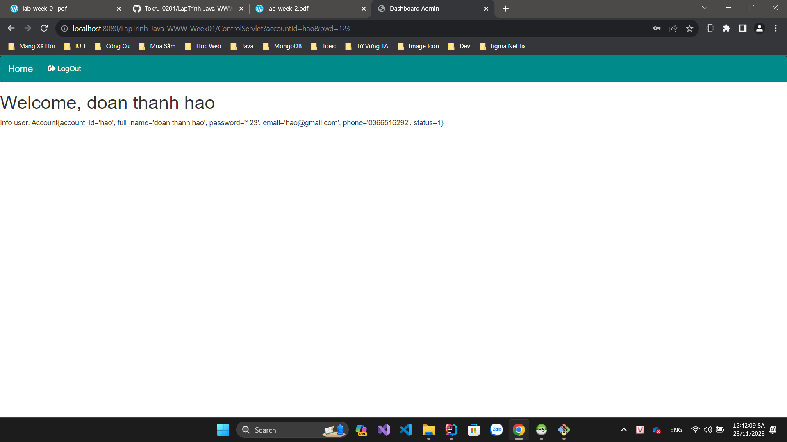

Đoàn Thanh Hào_20013831
- Ánh xạ các bảng dự liệu và thiết lập mối quan hệ:

- Kết nối với cơ sở dữ liệu

- Giao diện Login:

- Login khi account, password trống

- Login với quyền admin:
  - Hiển thị thông tin admin và các quyền
    
  - Quản lí các account hiện có
  
  - Ghi log mỗi lần account đăng nhập, đăng xuất
  
  - Các chức năng hoàn thành với quyền admin:
    + Thêm 1 account
    + Xóa 1 account
    + Logout quay về trang Login
- Login với quyền user:
  - Hiển thị thông tin user và các quyền
  
  - Các chức năng hoàn thành với quyền user:
    + Logout quay về trang Login

